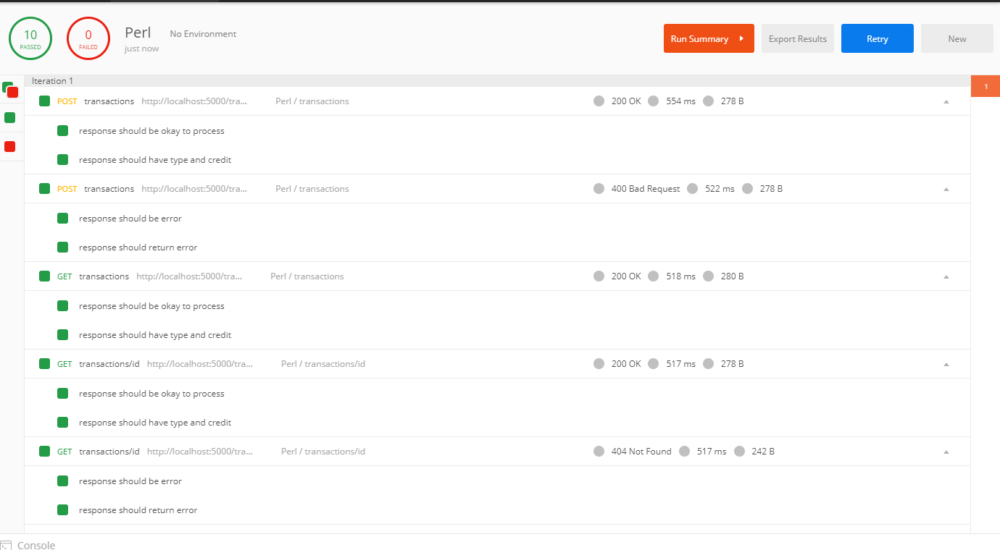
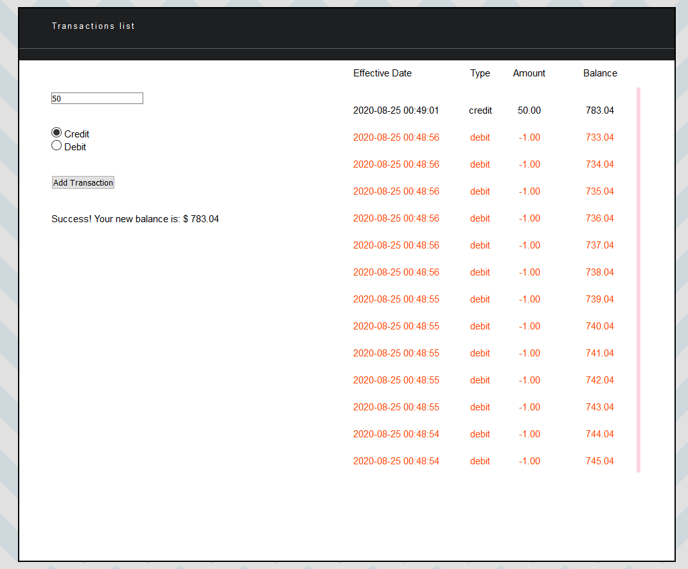

# perl-api-rest
API REST in Perl using Catalyst (Without current experience)

#### Project:
- [Video on Youtube][1]

The project was created using Catalyst Framework.

In lib/PerlRest/App we have our Controller Transactions and the Model Transaction.

In root/templates we have the UI. In root/static we have the public resources (css and js).

You can install catalyst and dependencies in your system (step 1.0) or use docker (step 1.1) ☺️
    
#### Step 1.0 - Install perl and catalyst:
    - Install PERL (http://strawberryperl.com/)
    - Install Catalyst Framework: cpanm -f Catalyst::Devel
      In Windows, versions up to 5.20 fail during test-TCP, so, use force (-f)
    - Install: cpanm Catalyst::Controller::REST
    - Install: cpanm Catalyst::Model::DBI
    - Install: cpanm Template::Toolkit
    - Install: cpanm Catalyst::View::TT
    - Install: cpanm DBD::SQLite
    
    - You can use: cpanm --installDeps .
    
    RUN: perl script/perlrest_app_server.pl -p 5000
    
#### Step 1.1 - Using Docker with a coffee in hand (20 min to build):
    - Move to docker folder
    
    Docker
    BUILD: docker build -t perl/rest .
    RUN: docker run --name=rest -it --rm -p 5000:5000 perl/rest
    
    Docker-Compose
    RUN: docker-compose up -d
        
#### Step 2 - Test our controller:
- [Postman template][2]

After run the rest, you can execute the postman request.

#### Step 3 - Test UI:

Go to `http://localhost:5000` and test the UI

The UI has Vue.js. And it does requests to the API Rest using Fetch.

#### TODO:

- ~~Docker~~ 
- Improve UI

[1]: https://www.youtube.com/watch?v=eYlCxA1xCLE&list=PLuHGXfTWz_BMzvffPXShwvZxBuv9jAR49
[2]: https://documenter.getpostman.com/view/8137382/TVCY5rkb    
[3]: http://localhost:5000    
